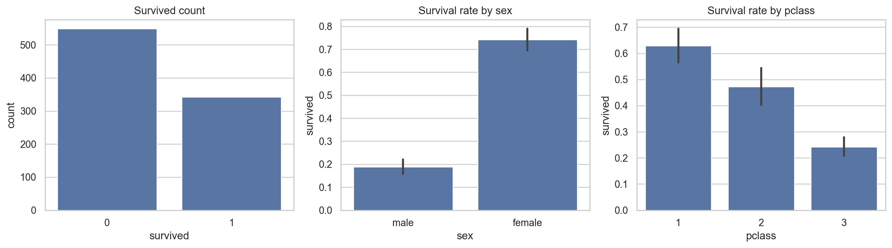
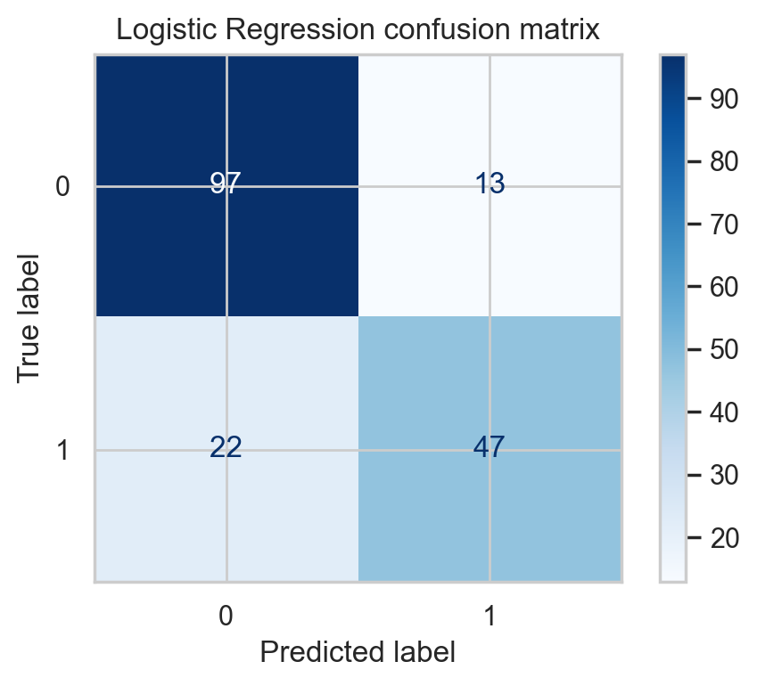
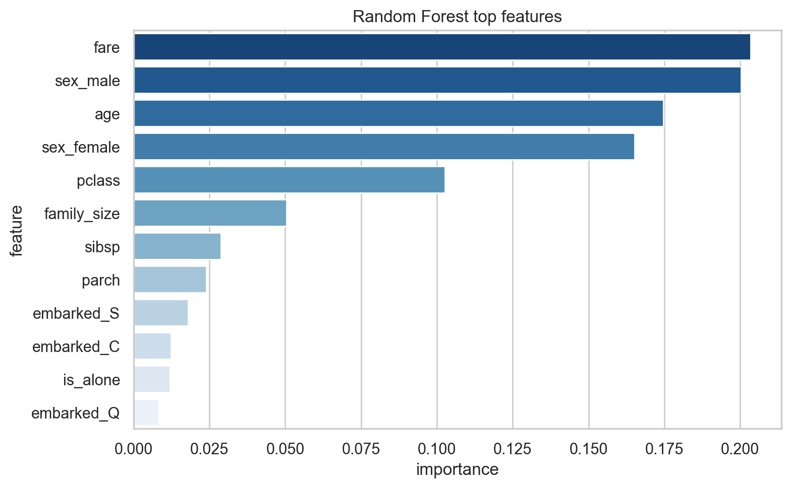

# Titanic Survival Prediction

I wanted one project that felt clear and complete, so I turned my Titanic notebook into a focused repo instead of leaving it buried inside the bigger practice repo.

The goal here was simple: predict whether a passenger survived, keep the preprocessing clean, and compare a linear model against a tree-based model without mixing the steps by hand.

## Dataset

- Source: Seaborn Titanic dataset
- Rows used: 891
- Working columns after feature prep: 10

## What I tried

- built a train/test split with stratification
- used one shared preprocessing pipeline for numeric and categorical columns
- compared Logistic Regression vs Random Forest
- tuned both models with cross-validation using F1
- checked confusion matrix, F1, ROC-AUC, and feature importance

## Best result

The best test-set result came from **Logistic Regression** in this run.

- Test Accuracy: `0.8045`
- Test F1: `0.7287`
- Test ROC-AUC: `0.8505`

Random Forest was very close, but Logistic Regression edged it out on test F1 here.

## Model comparison

| Model | Best CV F1 | Test Accuracy | Test F1 | Test ROC-AUC |
|---|---:|---:|---:|---:|
| Logistic Regression | 0.7294 | 0.8045 | 0.7287 | 0.8505 |
| Random Forest | 0.7508 | 0.8045 | 0.7244 | 0.8327 |

## Plots

### Survival overview


### Best model confusion matrix


### Random Forest feature importance


## What worked

- using one preprocessing pipeline made the comparison feel cleaner
- simple feature engineering like `family_size` and `is_alone` helped make the notebook feel more like a real project
- comparing models side by side was much better than trusting one score

## What did not work so well

- the gain over baseline was not huge, so this is more of a clean tabular ML project than a flashy leaderboard project
- Titanic is a classic dataset, so the value here is in how I structured the workflow, not in novelty

## What I would improve next

- add probability calibration and threshold tuning
- test gradient boosting models too
- turn the best pipeline into a small `predict.py` script for inference

## Files

- Notebook: `titanic_survival_prediction.ipynb`
- Metrics: `results/comparison.csv`
- Saved summary: `results/metrics.json`

## Run

```bash
pip install -r requirements.txt
```

Then open the notebook and run the cells top to bottom.
